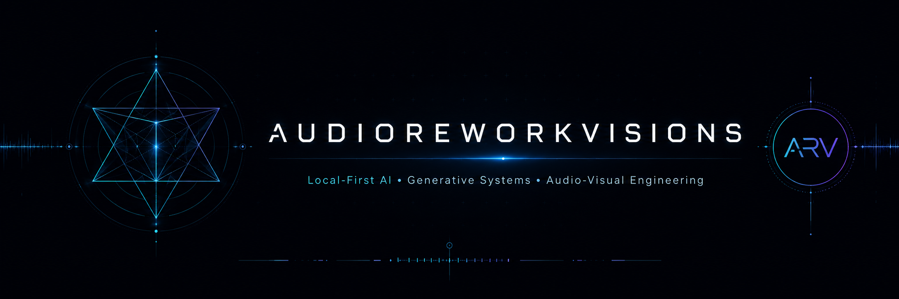
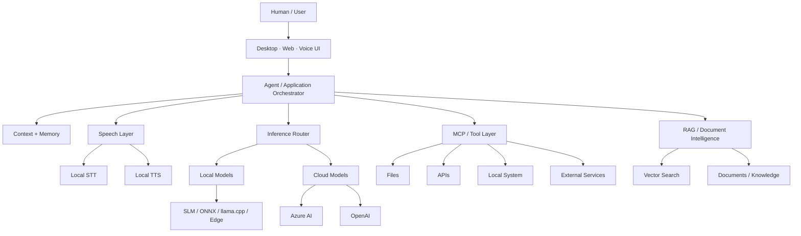

<p align="center">
  
</p>

<h1 align="center">Lenox <sub>aka Audioreworkvisions</sub></h1>

<p align="center">
  <strong>Autodidact Software Developer · Generative AI Builder · Audio-Visual Creator</strong>
</p>

<p align="center">
  Building local-first and hybrid AI systems where
  <strong>human intent, machine intelligence, software and audiovisual culture</strong>
  meet.
</p>

<p align="center">
  <a href="https://github.com/audioreworkvisions">
    
  </a>
  <a href="https://www.audioreworkvisions.ch">
    
  </a>
  <a href="https://orcid.org/0009-0004-2502-0849">
    
  </a>
  
</p>

---

## About

My path into software did not begin in a university or research lab.

It began with questions, experimentation, persistence and the decision to understand how modern computer systems actually work — from operating systems and application architecture to machine learning, generative AI and local inference.

I build software around a simple idea:

> **AI becomes truly interesting when it stops being just a chat window and becomes a runtime layer inside real software.**

My work explores systems that can **reason, retrieve information, use tools, process documents, understand speech, generate speech, orchestrate models and interact with local or cloud resources**.

I am particularly interested in architectures where cloud AI is optional rather than mandatory.

---

## Current Focus

```text
LOCAL-FIRST AI
     │
     ├── Small Language Models
     ├── Local STT / Speech Recognition
     ├── Local TTS / Voice Synthesis
     ├── ONNX / Edge Inference
     ├── Context + Memory
     └── Tool Execution
              │
              ▼
      AGENTIC APPLICATIONS
              │
     ┌────────┼─────────┐
     ▼        ▼         ▼
    RAG      MCP      Desktop
     │      Tools       Apps
     │        │          │
     └────────┼──────────┘
              ▼
      HYBRID AI ROUTER
       Local ↔ Cloud
```

My current development work concentrates on:

- **Local-first Generative AI**
- **Small Language Models / SLMs**
- **Local speech-to-text systems**
- **Local text-to-speech systems**
- **Hybrid local + cloud inference**
- **Agentic AI architectures**
- **Model Context Protocol / MCP**
- **Tool calling and agent orchestration**
- **Retrieval-Augmented Generation / RAG**
- **Document intelligence**
- **Long-term context and memory systems**
- **AI-native desktop applications**
- **Multimodal and audiovisual interfaces**
- **Generative visual systems**
- **OBS / broadcasting automation**
- **AI-assisted music and media workflows**

---

# Hybrid AI Architecture

A large part of my experimentation revolves around keeping the application independent from any single model provider.



The objective is not merely to call an LLM.

The objective is to build an **AI runtime** capable of deciding where computation should happen and which resources should be used.

---

## Local Intelligence

I am increasingly interested in running meaningful AI workloads directly on consumer hardware.

### Local Language Models

Areas I explore include:

```text
Small Language Models
        +
Quantized Models
        +
ONNX Runtime
        +
llama.cpp-style inference
        +
Windows / Edge AI
        +
Local context
        +
Tool execution
```

The goal is to make AI applications:

- more private
- less dependent on external APIs
- cheaper to operate
- usable offline
- more deterministic
- modular
- easier to integrate into desktop software

Cloud models remain valuable, but they should be a **capability**, not necessarily the entire architecture.

---

## Local Speech Stack

One of my current areas of development is combining:

```text
Microphone
    ↓
Local STT
    ↓
Local / Hybrid SLM
    ↓
Agent + Tools + Context
    ↓
Local TTS
    ↓
Voice Response
```

This creates the foundation for AI applications that can communicate naturally without requiring every audio stream or inference request to leave the machine.

Current areas of experimentation include:

- speech recognition
- streaming transcription
- local voice synthesis
- low-latency inference
- voice activity detection
- conversational state
- interruption handling
- local SLM integration
- local/cloud fallback routing

---

# Selected Public Projects

## JustitiaAI

[](https://github.com/audioreworkvisions/JustitiaAI)

**Retrieval-Augmented Generation for Swiss legal information.**

JustitiaAI explores AI-assisted access to Swiss legal material using RAG, document retrieval and generative AI.

Core concepts include:

- Azure OpenAI
- Azure AI Search
- vector retrieval
- document ingestion
- source-grounded answers
- citations
- semantic search
- document intelligence
- conversational legal research

The project represents an early step toward more advanced legal AI systems and later experiments such as LexOIMM.

---

## AVA-App

[](https://github.com/audioreworkvisions/AVA-App)

Experimental desktop application combining:

```text
Electron
   +
Vue
   +
Vite
   +
Python
   +
AI interaction
```

AVA explores the integration of desktop software, Python processing, file workflows, camera input and AI-assisted interaction inside a cross-platform application architecture.

---

# Active Labs & Evolving Systems

Some of my most active work exists as prototypes, evolving repositories, experiments or private development environments rather than polished public products.

## LexOIMM

**Legal AI · Agentic Desktop System · Document Intelligence**

An evolving AI workspace oriented toward Swiss legal research and professional document workflows.

Conceptually, LexOIMM combines:

```text
Electron Desktop Client
        │
        ├── Legal Documents
        ├── PDF Intelligence
        ├── RAG
        ├── Vector Search
        ├── Agent Reasoning
        ├── Persistent Context
        │
        └── Hybrid AI
                 │
          Local ↔ Azure / Cloud
```

The long-term goal is not simply a legal chatbot, but an **AI-native professional workspace**.

---

## ARV Story Engine / HYROGLYPHS

Experimental generative storytelling and audiovisual system.

Areas include:

- AI-assisted story construction
- generative visual composition
- scene generation
- still-frame pipelines
- visual remix systems
- prompt orchestration
- multimodal generation
- asset libraries
- audiovisual sequencing

The project explores the intersection of:

> **software × generative AI × visual language × narrative systems**

---

## Local Voice + SLM Runtime

Experimental local conversational runtime combining:

- local speech recognition
- local speech synthesis
- local SLM inference
- contextual memory
- tool execution
- hybrid cloud fallback
- streaming responses

The objective is a lightweight conversational AI layer capable of operating primarily on-device.

---

## MCP / Proxy Agent Infrastructure

Experiments around providing a common orchestration layer between applications and AI systems.

```text
Application
     │
     ▼
Agent Runtime
     │
     ├── MCP Servers
     ├── Open Interpreter
     ├── Local Models
     ├── ONNX Models
     ├── Cloud Models
     ├── REST APIs
     └── Local Tools
```

A core principle is avoiding tightly coupling an application to one AI provider.

---

## Crypto Trader Companion

Experimental AI-assisted cryptocurrency research and market-analysis system.

Research areas include:

- portfolio monitoring
- market context
- technical indicators
- news evidence
- on-chain context
- risk analysis
- strategy simulation
- signal scoring
- paper trading
- explainable recommendations

This project is an experimental decision-support and research environment — **not a promise of guaranteed financial returns**.

---

## Audiovisual / OBS Tooling

A parallel engineering track inside Audioreworkvisions focuses on tools for live audiovisual performance.

Experiments include:

- OBS integrations
- automatic track-ID overlays
- DJ metadata systems
- audiovisual control interfaces
- generative visuals
- media libraries
- video-to-GIF processing
- loop generators
- slideshow engines
- streaming overlays
- live performance utilities

These systems connect my software work directly with my work as an audiovisual creator and Techno DJ.

---

# Technology Stack

## Languages

<p>
  
  
  
  
  
</p>

---

## Application Development

<p>
  
  
  
  
  
</p>

---

## Backend & Runtime

<p>
  
  
  
  
</p>

---

## AI / Machine Learning

<p>
  
  
  
  
  
  
  
</p>

---

## Data & Retrieval

<p>
  
  
  
  
</p>

---

## Development Environment

<p>
  
  
  
  
  
  
</p>

---

# What I Am Exploring

| Area | Direction |
|---|---|
| **Local AI** | Small and quantized models running directly on consumer hardware |
| **Speech AI** | Local STT + TTS connected to conversational agents |
| **Hybrid Inference** | Dynamically routing requests between local and cloud models |
| **Agentic Systems** | Models capable of selecting tools and performing structured workflows |
| **MCP** | Standardized interfaces between AI systems, software and external tools |
| **RAG** | Grounding AI responses in documents and trusted knowledge |
| **Memory** | Persistent application and conversational context |
| **Desktop AI** | Moving AI capabilities from browser demos into real applications |
| **Legal AI** | Document intelligence and retrieval for Swiss legal workflows |
| **Generative Media** | AI-assisted visual, narrative and audiovisual systems |
| **Audio AI** | Speech, music metadata and live-performance tooling |
| **Human–AI Interfaces** | Interfaces where AI behaves as part of the application rather than an isolated chatbot |

---

# Engineering Principles

### 01 — Local when possible

If a task can run safely and efficiently on the user's machine, local execution should remain a serious option.

### 02 — Cloud when useful

Powerful cloud models are valuable, especially for complex reasoning and multimodal workloads.

The architecture should decide when they are required.

### 03 — Models are replaceable

Applications should not be designed around one model.

```text
Application Logic
       ≠
Model Provider
```

Models should be interchangeable components behind a stable application layer.

### 04 — Context is infrastructure

Useful AI requires more than a prompt.

It requires:

```text
Context
+ Memory
+ Retrieval
+ Tools
+ State
+ Permissions
+ Models
```

### 05 — AI should use software

The next generation of AI applications should not only generate text.

They should interact with:

- files
- databases
- APIs
- applications
- operating-system capabilities
- external tools
- structured workflows

### 06 — Build systems, not demos

My interest is increasingly focused on turning AI concepts into persistent software architectures rather than isolated experiments.

---

# Audioreworkvisions

**Audioreworkvisions / ARV** is where several disciplines intersect:

```text
SOFTWARE
   ×
ARTIFICIAL INTELLIGENCE
   ×
SOUND
   ×
VISUAL SYSTEMS
   ×
TECHNO CULTURE
```

Alongside software development, I produce audiovisual experiments and Techno transmissions under the Audioreworkvisions identity.

This creates an unusual engineering environment where tools are often tested in real creative workflows rather than artificial demonstrations.

Examples include:

- live visuals
- generative imagery
- DJ interfaces
- OBS systems
- track metadata
- audiovisual automation
- real-time media pipelines
- experimental human-machine interfaces

The creative work and software work are not separate projects.

They continuously influence each other.

---

# Development Philosophy

My route into technology has been unconventional.

I learn primarily by:

```text
QUESTION
   ↓
RESEARCH
   ↓
BUILD
   ↓
BREAK
   ↓
UNDERSTAND
   ↓
REBUILD
   ↓
CONNECT
```

I am less interested in memorizing isolated technologies than in understanding how systems connect.

Operating systems lead to application architecture.

Application architecture leads to APIs.

APIs lead to distributed systems.

Distributed systems lead to agents.

Agents lead to models.

Models lead back to hardware.

And eventually everything becomes one system.

---

# GitHub

<p align="center">
  <a href="https://github.com/audioreworkvisions">
    
  </a>
  <a href="https://github.com/audioreworkvisions?tab=repositories">
    
  </a>
</p>

My repositories include original applications, experiments, research prototypes, reference implementations and forks used to study technologies across the AI ecosystem.

Current areas of repository research include:

```text
Agentic AI
Local AI
Windows ML
Foundry Local
Azure AI
RAG
MCP
LLM Interfaces
Model Inference
Speech
Desktop Applications
Generative Media
```

---

# Connect

<p align="center">

<a href="https://www.audioreworkvisions.ch">
  
</a>

<a href="https://github.com/audioreworkvisions">
  
</a>

<a href="https://www.linkedin.com/in/audioreworkvisions/">
  
</a>

<a href="https://www.youtube.com/@audioreworkvisions">
  
</a>

<a href="https://x.com/audioreworks">
  
</a>

<a href="https://orcid.org/0009-0004-2502-0849">
  
</a>

<a href="https://medium.com/@audioreworkvisions.net">
  
</a>

<a href="https://dev.to/audioreworkvisions">
  
</a>

<a href="mailto:artist@audioreworkvisions.com">
  
</a>

</p>

---

<p align="center">
  <strong>Stay curious. Stay in the tunnel. Keep building.</strong>
</p>

<p align="center">
  <sub>Lenox aka Audioreworkvisions · Switzerland</sub>
</p>
